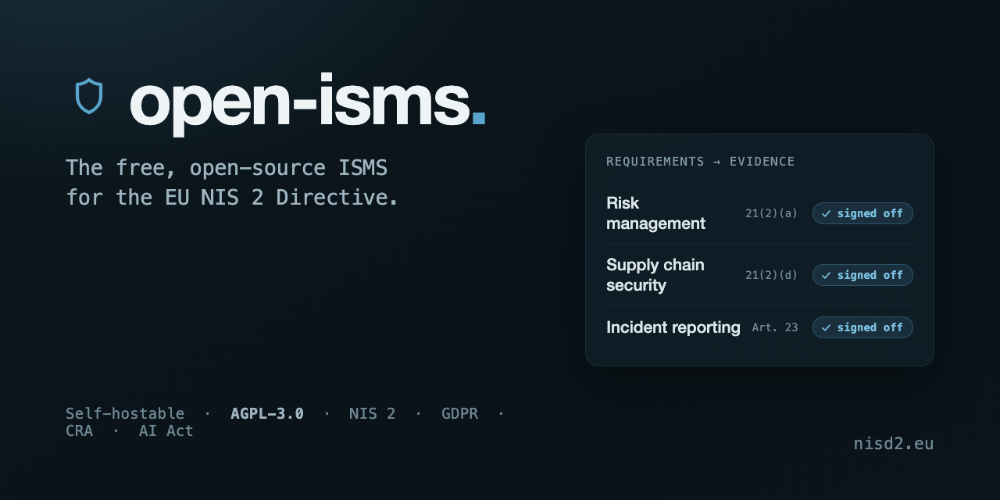

<p align="center">
  
</p>

<p align="center">
  <a href="https://www.npmjs.com/package/@nisd2/grc-data-model"></a>
  <a href="https://github.com/NISD2/open-isms/actions/workflows/ci.yml"></a>
  <a href="LICENSE"></a>
  <a href="https://www.nisd2.eu"></a>
</p>

---

The platform behind [nisd2.eu](https://www.nisd2.eu): a self-hostable Information Security Management System built for the EU NIS 2 Directive, with GDPR, the EU AI Act, and the CRA alongside it.

Most compliance tooling treats evidence as a folder of PDFs you assemble the week before an audit. open-isms inverts that. Every requirement carries an owner, a deadline, and a sign-off, so assignments, approvals, and an append-only audit trail become your evidence as you operate, not something you reconstruct after the fact.

Free and open source. AGPL-3.0. Mission: halve Europe's NIS 2 compliance bill.

## What's in here

```
apps/
  reference/                      # minimal docker-compose demo (Postgres + Next.js)
                                  # boot stack, gates routes behind email magic links

packages/
  grc-data-model/                 # framework data + entity model (NIS 2, GDPR, EU AI Act, CRA)
  incident-notification-schema/   # NIS 2 §23(4) incident notification format
  isms-schema/                    # operational ISMS schema (audit-log, sign-off, evidence, policies, training)
  isms-ui/                        # shadcn-based UI primitives
  isms-pages/                     # pre-translated page components
  isms-lib/                       # compliance helpers (deadlines, format)
  isms-trpc/                      # tRPC setup + audit middleware
  isms-messages/                  # i18n catalogs

app/                              # the production SaaS — marketing + portal + supplier + training
components/  lib/  schema/  server/  drizzle/  messages/  i18n/   # SaaS app code
courses/                          # NIS 2 CEO course content + tabletop exercises + CRA SBOM
data/  docs/                      # public reference data + deployment docs
public/                           # static assets

scripts/                          # operational + release tooling
.github/workflows/                # CI + release pipeline
```

`grc-data-model` and `incident-notification-schema` are published to npm. The other packages are workspace-only (consumed via bun workspaces; not on npm yet).

## Quick start (local dev)

```bash
git clone https://github.com/NISD2/open-isms.git
cd open-isms
bun install
bun run dev               # http://localhost:3026
```

## Quick start (self-host the whole platform)

```bash
mkdir open-isms && cd open-isms
curl -o compose.yaml https://raw.githubusercontent.com/NISD2/open-isms/main/compose.self-host.yml
curl -o .env         https://raw.githubusercontent.com/NISD2/open-isms/main/.env.self-host.example
curl -o Caddyfile    https://raw.githubusercontent.com/NISD2/open-isms/main/Caddyfile.self-host.example
# fill in the required values in .env, then:
docker compose up -d                        # http://localhost:3026
```

No clone and no fork: this pulls the same published image nisd2.eu runs, with
a bundled MinIO for evidence files so no AWS account is needed. Migrations
apply at container start, and `OPEN_ISMS_VERSION` in `.env` decides whether
you follow releases or pin one.

Full walkthrough, the environment variables, and which third-party services
you can do without: **[docs/self-hosting.md](./docs/self-hosting.md)**.
Updating and rollback: **[docs/updating.md](./docs/updating.md)**.
Backup and restore: **[docs/backup.md](./docs/backup.md)**.

For the minimal workspace demo instead of the full platform:

```bash
cd apps/reference
cp .env.example .env      # set AUTH_SECRET via `openssl rand -base64 32`
docker compose up --build # http://localhost:3000
```

## Quick start (just the schema packages)

```bash
bun add @nisd2/grc-data-model @nisd2/incident-notification-schema
```

```ts
import { nis2Categories, getNis2RequirementsForCategory } from "@nisd2/grc-data-model/frameworks";
import { complianceFramework, requirement } from "@nisd2/grc-data-model/schema";
```

49 NIS 2 articles, 7 GDPR articles, NIS 2 ↔ GDPR mappings, Drizzle-compatible Postgres schema.

## Legal scope

- **EU Directive**: 2022/2555 (NIS 2)
- **German transposition**: NIS2UmsuCG → revised BSIG (2025)
- **Implementing Regulation**: Commission Implementing Regulation (EU) 2024/2690
- **Effective**: 6 December 2025
- **Registration deadline**: 6 March 2026

## Tech stack

| Layer | Tech |
|---|---|
| Framework | Next.js 16 + React 19 (App Router, SSR-first) |
| Language | TypeScript 5.7 strict mode |
| Styling | Tailwind CSS 4 + shadcn |
| Validation | Zod 4 |
| ORM | Drizzle 0.45 (Postgres) |
| API | tRPC 11 |
| Auth | Auth.js v5 (email magic links + Google OAuth) |
| i18n | next-intl (DE/EN/NL) |
| AI | Vercel AI SDK + xAI Grok for form prefill |
| Runtime | Bun 1.3+ |
| Hosting | Coolify (self-hosted) |

## Contributing

See [CONTRIBUTING.md](./.github/CONTRIBUTING.md). External PRs welcome — particularly:

- New framework articles / mappings (`packages/grc-data-model/src/frameworks/`)
- Translation work (`messages/`, `packages/isms-messages/`)
- Schema improvements (`packages/isms-schema/src/tables/`)
- Documentation and examples

For security disclosures, see [SECURITY.md](./.github/SECURITY.md).

## License

[AGPL-3.0-or-later](./LICENSE) for the app, scripts, and workspace-only packages.

Published npm packages have their own licenses:

| Package | License |
|---|---|
| `@nisd2/grc-data-model` | MIT |
| `@nisd2/incident-notification-schema` | Dual: AGPL-3.0 + commercial |
| `@nisd2/isms-*` (workspace-only) | AGPL-3.0-or-later |
